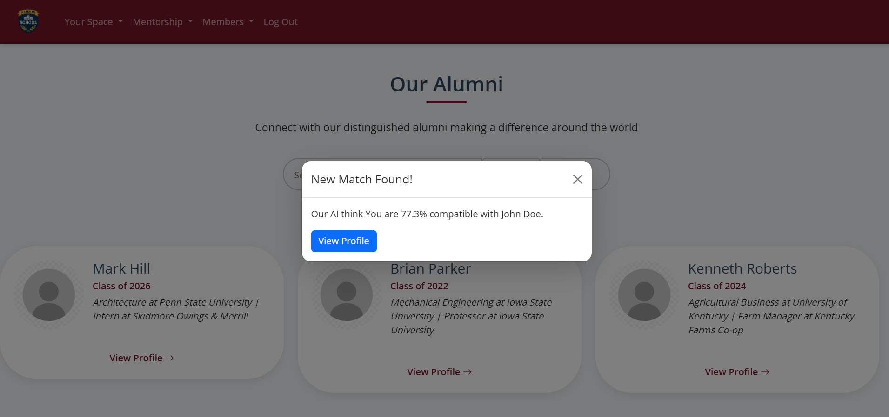
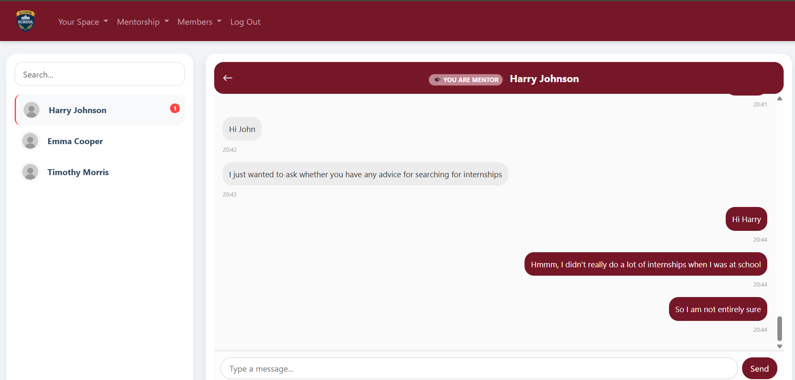
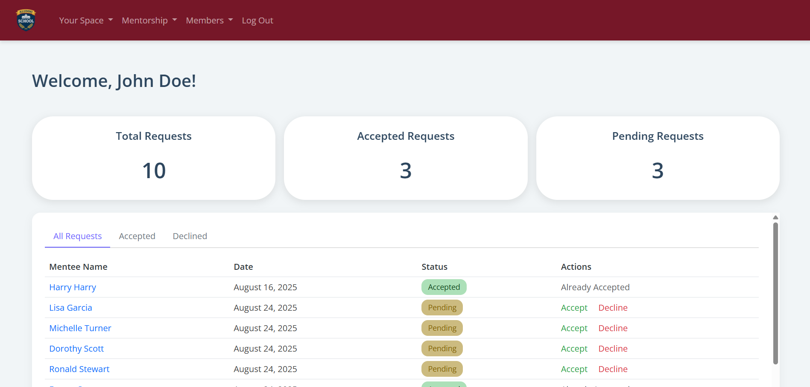
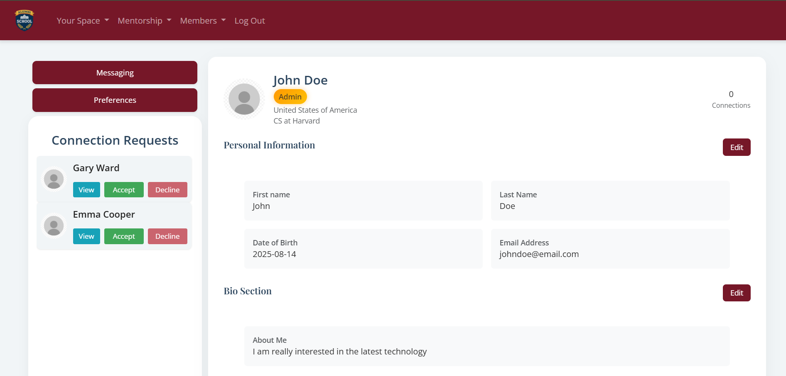
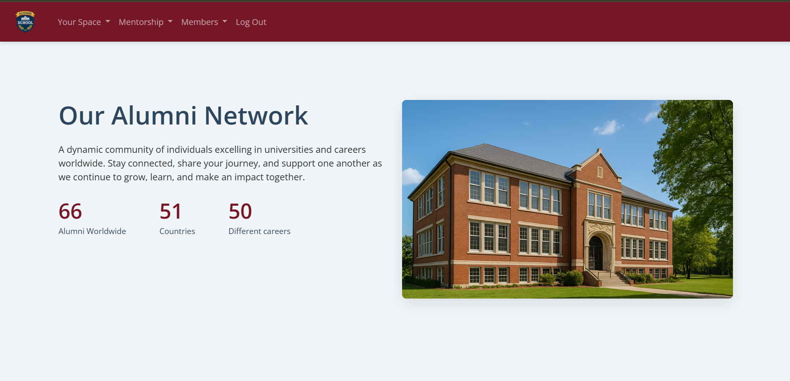
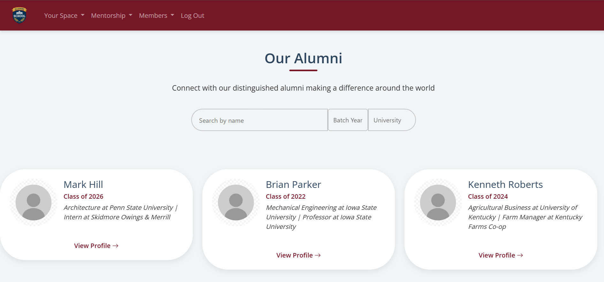

# Alumni Website - AI-Powered Networking Platform
## Table of Contents
- [Quick Overview](#quick-overview)
- [Key Features](#key-features)
- [Motivation](#motivation)
- [Demo](#demo-and-screenshots)
- [Architecture](#architecture)
- [Technical Details](#technical-highlights)
- [Challenges faced](#challenges-faced)
- [Links](#links)
## Quick Overview
- **Users:** ~60 active students and alumni.
- **Connections:** 229 connection requests exchanged; 15 mentor–mentee pairs matched.
- **Purpose:** Intelligent alumni networking & mentorship platform that keeps graduates and current students connected and supports growth.
- **Project:** A solo project combining skills from CS50X, CS50 Web, and CS50 AI, created to give students mentorship and networking opportunities.
- **Key Tech:** Django, PostgreSQL, WebSockets, BERT/TF-IDF + SVM, A*-inspired heuristics + Personalized PageRank recommendation engine.
>For more details: [Technical Details](docs/technical_details.md) and [Dev logs](docs/dev_logs.md)

> Demo: https://youtu.be/vp2V15UOsaE
## **Key Features:**
- **User profiles:** Searchable alumni and mentor database with editable user info
- **Mentorship program:** Request, accept, & allow mentors to manage requests seamlessly through their personalized dashboard
- **Dynamic Directory Search:** Name/skill + filters by university & batch year
- **Real-time chat:** WebSocket and Django channels-powered messaging 
- **AI Categorization:** BERT/TF-IDF (from Hugging Face) + SVM model (from scikit-learn) to classify skills and goals
- **Recommendation Engine:** A*-like heuristics + Personalized PageRank.
        - Database flag allows toggling to a **simplified recommendation algorithm** for smaller user scales.
- **Notification email:** Authentication links, mentor and connection request notifications, weekly digests.
- **Security Features:** Added limits for login and signup attempts through stopping IP addresses, passwords are stored as hashes using SHA256 hash, and deployed website uses HTTPS
## Motivation
When I joined a new school two years ago, I was fortunate to find supportive seniors who helped me navigate university applications, resources, and student life. Not everyone has that network. I set out to build a platform where students and alumni could connect, request mentorship, and share advice.

I first prototyped a minimal profile system in Flask, then rebuilt it in Django after completing web development coursework. As I learned more about algorithms and AI, I integrated a recommendation engine (A*-inspired + PageRank heuristics) and an ML-based skill/goal classifier.

The project evolved with feedback from early users — I added email notifications, security limits, and UI prompts based on actual student behavior.

Today, ~60 users are registered and it has already supported 229 connections and 15 formal mentor–mentee matches. For me, the platform is both a technical challenge and a social experiment: how to encourage meaningful networking with limited data and scale.
## Architecture:
- **Frontend:** HTML, CSS, JavaScript.
- **Backend:** Django (Python). 
- **Database:** PostgreSQL.
- **AI/ML:** TF-IDF/BERT embeddings + SVM classifiers used to create a supervised learning model built on my own database; pathfinding algorithm (A* search) inspired heuristics + Personalized PageRank recommendation engine.
- **Messaging:** Django Channels with WebSockets & in-memory layer.
- **Emails:** Authentication emails are sent via **SendGrid** for speed; other notifications via **Gmail SMTP**.
- **Deployment:** Render (linked to custom domain) + Supabase PostgreSQL.
## Demo and Screenshots
> **Demo:** https://youtu.be/vp2V15UOsaE
<table>
  <tr>
    <td></td>
    <td></td>
  </tr>
  <tr>
    <td align="center">AI recommendation</td>
    <td align="center">Messages</td>
  </tr>
</table>
<table>
  <tr>
    <td></td>
    <td></td>
  </tr>
  <tr>
    <td align="center">Mentor Dashboard</td>
    <td align="center">Profile Page</td>
  </tr>
</table>
<table>
  <tr>
    <td></td>
    <td></td>
  </tr>
  <tr>
    <td align="center">Home Page</td>
    <td align="center">Alumni Directory</td>
  </tr>
</table>

## Technical Highlights
>See [Technical details](docs/technical_details.md)
- Recommendation Engine:
    - Models users as nodes in a weighted graph.
    - A* heuristic prioritizes skill, goal, education, and location compatibility.
    - Personalized PageRank surfaces globally relevant but non-obvious matches.
    - Optimizations: caching, vectorization, pruning, and batch processing.
- AI Classifier:
    - Supervised ML with BERT embeddings + SVM
    - Directly using BERT exceeded memory limits (512 MB RAM), so I switched to using TF-IDF to approximate BERT embeddings.
    - Goal classifier: 87% F1 score; Skill classifier: 71% F1 score with a 80/20 train/test split (300-sample dataset).
      - I've tried many different methods to bring up the skill classifiers F scores, but skills seem to be very difficult to categorize as they are single words and overlap in many categories. This could also explain why the F1 score were lower when I used ~500 fields for the dataset compared to ~300
    - Integrated into user profile updates.
- Messaging System:
    - Full-duplex WebSocket channels for low-latency communication.
    - Saves messages to PostgreSQL; broadcasts via memory channel layer.
## Challenges Faced
- **Optimizing the Recommendation Engine**
  - My first prototype was slow, taking 30–90 seconds for even 10 users. I had to rethink efficiency: ORM optimizations, caching, pruning, and NumPy-based transition matrices reduced results to under a few seconds.
- **Messaging System & WebSockets**
  - Real-time chat required moving from WSGI to ASGI, but version mismatches and external DB latency repeatedly broke connections. Fixing this taught me more about deployment than expected.
- **Choosing the Right Classifier**
  - Directly running BERT was impossible under 512 MB RAM. I switched to TF-IDF, which is trained to predict BERT embeddings, sacrificing some accuracy but making the model deployable at scale.
## Links
- My Dev Log and Learning Journal: [dev_logs.md](docs/dev_logs.md)
- Technical details: [technical_details.md](docs/technical_details.md)